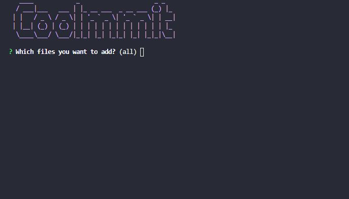
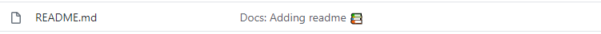

<h1 align="center">Welcome to Coolmmit 👋</h1>
<h4 align="center">A cli that help you standardize and make your commits cool</h4>
<p align="center">
  
  <a href="#" target="_blank">
    
  </a>
</p>

## ✨ Demo



How it looks on github:



## Usage

Make sure you have npx installed (npx is shipped by default since npm 5.2.0)

```sh
npx coolmmit
```

### With parameters:

Example:

```sh
npx coolmmit -a hello-world.js -t feat -m "Did something"
```

- -add or -a : Add a file to tracking (same as "git add"), without this parameter all files will be added.
- --type or -t: Type of your commit, supported types:
  - **Feat** (new feature for the user, not a new feature for build script)
  - **Fix** (bug fix for the user, not a fix to a build script)
  - **Docs** (changes to the documentation)
  - **Style** (formatting, missing semi colons, etc; no production code change)
  - **Refactor** (refactoring production code, eg. renaming a variable)
  - **Test** (adding missing tests, refactoring tests; no production code change)
  - **Chore** (updating grunt tasks etc; no production code change)
- --message or -m: Type what you have done (same as "git commit -m")

## Author

👤 **Lucas Ferreira <lucsferreira.dev@gmail.com>**

## Show your support

Give a ⭐️ if this project helped you!

---

_This README was generated with ❤️ by [readme-md-generator](https://github.com/kefranabg/readme-md-generator)_
